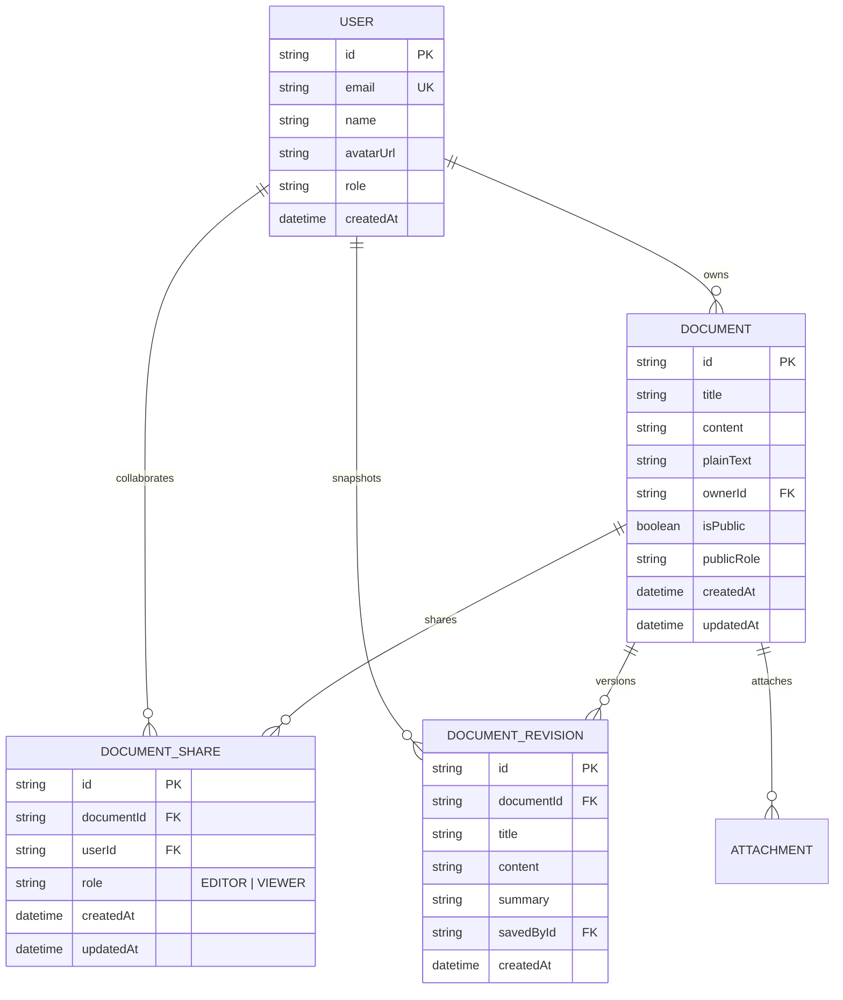

# Architecture & Engineering Decisions Note

**Candidate:** Tooba Baqai (`toobabaqai1@gmail.com`)  
**Role:** AI-Native Full Stack Product Engineer  
**Project:** Ajaia Docs — Lightweight Collaborative Document Workspace  
**Date:** August 2026

---

## 1. System Overview

Ajaia Docs is a modern full-stack web application designed for fast, conflict-free collaborative writing and document organization. The system is engineered around five core pillars:
1. **Low-Latency Rich-Text Interaction**: Seamless WYSIWYG editing with predictable document schema.
2. **Deterministic Role-Based Access Control (RBAC)**: Clear boundaries separating document owners, contributing editors, and read-only viewers.
3. **Multi-Format Ingestion Engine**: Zero-friction file import for Microsoft Word (`.docx`), Markdown (`.md`), Plain Text (`.txt`), and HTML.
4. **Resilient Persistence & Revision Snapshots**: Auto-saving state transitions with point-in-time recovery.
5. **Zero-Setup Reviewer Experience**: In-app persona switcher allowing instant verification of multi-user permission states without mock server configuration.

```mermaid
graph TD
    Client[Next.js 15 React Client] -->|HTTP / JSON / FormData| NextAPI[Next.js App Router API Routes]
    
    subgraph "Frontend Layer"
        Client --> EditorCanvas[EditorCanvas TipTap / ProseMirror]
        Client --> ShareModal[ShareModal RBAC Manager]
        Client --> FileUpload[FileUpload Drag-and-Drop Ingestion]
        Client --> UserSwitcher[Persona Switcher & AuthContext]
    end

    subgraph "Backend API Layer"
        NextAPI --> DocAPI[/api/documents CRUD & Filter]
        NextAPI --> ShareAPI[/api/documents/:id/share RBAC]
        NextAPI --> ImportAPI[/api/documents/import Mammoth & Marked]
        NextAPI --> RevisionAPI[/api/documents/:id/revisions]
    end

    subgraph "Persistence Layer"
        NextAPI --> Prisma[Prisma ORM Client]
        Prisma --> SQLite[(SQLite Database dev.db)]
    end
```

---

## 2. Data Model & Schema Design

The data model is expressed in Prisma with relational foreign keys and cascading integrity:



---

## 3. Access Control & Security Model

Document access is governed by the `resolveUserRole` function:

```typescript
export function resolveUserRole(
  document: PermissionCheckDoc,
  userId?: string | null
): 'OWNER' | 'EDITOR' | 'VIEWER' | null {
  if (!userId) {
    return document.isPublic ? (document.publicRole as Role) || 'VIEWER' : null;
  }
  if (document.ownerId === userId) return 'OWNER';
  
  const directShare = document.shares?.find(s => s.userId === userId);
  if (directShare) return directShare.role as Role;
  
  return document.isPublic ? (document.publicRole as Role) || 'VIEWER' : null;
}
```

### Permission Matrix

| Capability | Document Owner (`OWNER`) | Invited Editor (`EDITOR`) | Invited / Public Viewer (`VIEWER`) | Uninvited Visitor |
| :--- | :---: | :---: | :---: | :---: |
| **View Document** | ✅ | ✅ | ✅ | ❌ (Unless Public) |
| **Edit Content & Title** | ✅ | ✅ | ❌ | ❌ |
| **Import / Insert Files** | ✅ | ✅ | ❌ | ❌ |
| **Manage Collaborators** | ✅ | ❌ | ❌ | ❌ |
| **Change Public Link Settings**| ✅ | ❌ | ❌ | ❌ |
| **Delete Document** | ✅ | ❌ | ❌ | ❌ |
| **Restore Revisions** | ✅ | ✅ | ❌ | ❌ |

---

## 4. File Ingestion & Parsing Engine

To make file upload genuinely useful in a document product:
- **Microsoft Word (`.docx`)**: Parsed server-side using `mammoth` into clean HTML structure (preserving headings, bold, italic, and paragraphs) while discarding messy Microsoft Word inline XML styles.
- **Markdown (`.md`)**: Parsed using `marked` AST into semantically compliant HTML elements.
- **Plain Text (`.txt`)**: Normalized, HTML-entity escaped, and wrapped in paragraph tags.
- **Dual Ingestion Paths**:
  1. *Create as New Document*: Directly creates a persistent database entity with the filename as document title.
  2. *Insert into Active Document*: Injects parsed nodes into the active ProseMirror editor instance without overwriting existing work.

---

## 5. Scope Prioritization & Intentional Tradeoffs

Given the 4-6 hour timebox, prioritization was strictly focused on shipping high-depth core capabilities over shallow surface breadth:

### What We Prioritized (High Depth)
1. **TipTap ProseMirror WYSIWYG Engine**: Chosen over basic `contenteditable` or monolithic Quill. Provides structured AST, robust markdown/HTML roundtripping, and production-grade formatting reliability.
2. **Rigorous RBAC at API and UI Levels**: Permissions are checked on every PUT, POST, and DELETE route, and visually enforced with disabled toolbars and read-only banners.
3. **Multi-Format File Ingestion**: Ingesting `.docx` and `.md` provides immediate product delight and workflow relevance.
4. **Frictionless Reviewer Persona Switcher**: Reviewers can switch between candidate and team lead personas in one click to verify access states instantly.
5. **Autosave & Version Snapshots**: 800ms debounced autosave with visual status indicators and snapshot rollback.

### What We Intentionally Deprioritized (With Rationale)
1. **Live P2P CRDT Synchronization (Yjs/WebSockets)**:
   - *Rationale*: Real-time operational transforms (OT) or Yjs require persistent WebSocket signaling servers, which add significant deployment fragility under tight evaluation constraints. We prioritized robust debounced autosave and simulated presence instead.
2. **Heavy OAuth / Magic-Link Infrastructure**:
   - *Rationale*: Requiring email verification or OAuth tokens creates unnecessary friction for reviewers. A seeded persona switcher demonstrates identical auth and session logic with zero testing hurdle.
3. **Cloud S3 Object Storage**:
   - *Rationale*: Local SQLite and base64/inline payload storage provides 100% deterministic local testing without external AWS credentials.

---

## 6. Production Roadmap (Next 2–4 Hours)

If allocated additional engineering time, the immediate next enhancements would be:
1. **Live Multi-User CRDTs via Yjs & PartyKit/WebSockets**: Adding real-time shared cursors, live character streaming, and conflict-free concurrent editing.
2. **Inline Comments & Suggestion Mode**: Allowing reviewers to highlight text spans and attach threaded comments.
3. **Cloud Object Storage (AWS S3 / Cloudflare R2)**: For uploading large PDF/image attachments.
4. **Full-Text Vector Search (SQLite FTS5 or pgvector)**: Instant semantic search across document bodies.
